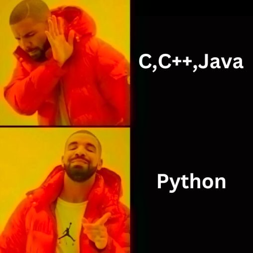

# Laboratory Activities 🔬

This document provides a summary of four laboratory activities. Each activity contains specific tasks designed to help learners develop foundational programming skills, with each task targeting a distinct learning goal. Below, you will find an overview of the activities, their purpose, and instructions.

### Laboratory Activity 1: INTRODUCTION to PYTHON 🐍

This activity strengthens foundational Python skills by combining user input, logical processing, and output formatting. It helps learners develop a deeper understanding of how characters are represented numerically and enhances their problem-solving abilities by connecting multiple programming concepts in a simple yet meaningful exercise.

*Item 1: Song Details*  
The user is prompt to enter details about a song, such as the year, genre, album, title, and artist. These inputs are then properly displayed in a prepared "Song Details" summary, giving students to practice taking user input, formatting strings with `f-strings`, and displaying ordered results.   

*Item 2: Character - ASCII Values*  
The user is asked to input two space-separated characters. The program determines and displays the character with the greater value using the `max()` function, which compares the ASCII values of the characters. It also displays the ASCII value of each character using the `ord()` function. This section helps learners understand how characters are compared in Python based on their ASCII values while introducing basic string operations like `split()` and working with built-in Python functions.

### Instructions for Reviewers  
1. Run the program
2. *Item 1*: Enter the correct song details
3. *Item 2*: Enter the character with the higher ASCII value is correctly identified.
4. Ensure that the output per item follows the specified format

### Laboratory Activity 2: LIBRARIES and CONTROL FLOW 📚  
The palindrome checker introduces string reversal and comparison, reinforcing concepts of data types and operations, while the purchase discount calculator offers practical experience in arithmetic operations and conditional statements. By connecting these programming concepts, learners can enhance their problem-solving abilities and gain a deeper understanding of how to apply logic to real-world scenarios in Python.  

*Item 1: Palindrome Checker*  
The program prompts the user to input an integer and checks whether the number reads the same forwards and backwards. If the number is a palindrome, it prints `"Palindrome"`; otherwise, it prints `"Not a Palindrome."`  

*Item 2: Discount Calculator*   
It prompts the user to enter a total purchase amount, then calculates a discount based on the amount: a 10% discount for amounts above 5000, and a 5% discount for amounts equal to or below 5000. The program displays the initial purchase amount, the discount applied, and the final price after the discount is deducted. It then asks the user if they wish to try again with a different purchase amount, allowing them to repeat the process or exit the program.  

### Instructions for Reviewers  
1. Run the code.
2. *Item 1*: Enter a number to check if it's a palindrome or not.
3. *Item 2*: Enter a purchase amount to see the discount and final price.
4. Verify that the output per item follow the specified format.

### Laboratory Activity 3: DICTIONARIES and LISTS 📑 
The learners practice handling user input, conditional logic, loops, and arithmetic operations, while also deepening their understanding of numeral systems and number theory.  

*Item 1: Roman Numeral to Integer Converter*  
The code provides a function `roman_to_integer` that converts a given Roman numeral into its corresponding integer value. It uses a dictionary to map Roman numeral characters to their integer values and applies logic to correctly interpret numerals like `"IV"` or `"IX"` by considering subtractive notation.  

*Item 2: Perfect Number Checker*  
The code defines a function `is_perfect_numbe`r to check if a given number is a perfect number. A perfect number is a positive integer that is equal to the sum of its proper divisors, excluding itself.  

### Instruction for Reviewers  
1. Run the code.
2. *Item 1*: Enter a Roman Numeral.
3. *Item 2*: Enter a Number.
4. Confirm that the output per item is specified correctly.

### Laboratory Activity 4: PYTHON OOPs 🖥️
It demonstrates object manipulation through class instances and error handling for array operations.  

*Item 1: Capybara Class and Test Cases*  
The code defines a `Capybara class`, which stores the name, gender, and age of a capybara. Two instances of this class are created, `capybara1` and `capybara2`, representing two different capybaras. The user is prompted to enter a test case number, which will select one of the two capybaras and display their details (name, gender, and age).

*Item 2: Array Element Access*  
The user is prompted to input the size of the array and its elements, which are stored as floating-point numbers. The user can then input an index, and the program will attempt to print the element at that index. If the index is out of bounds, an `IndexError` is caught and an appropriate error message is displayed. Similarly, if a non-numeric value is entered for the array elements, a `ValueError` is raised, and an error message is displayed to prompt the user for numeric input only.  

### Instructions for Reviewers  
*Item 1*
1. Run the `script.py` file.
2. Enter a valid test case number.
3. Assure that the program correctly display the `Capybara` objects and its attributes.

*Item 2*  
1. Run the code.
2. Enter the size and elements of the array.
3. Verify if the program prints the correct element for a valid index.

### Tips! 💡
- Before writing any code, take the time to understand the problem you're solving.
- Use meaningful and variable names, consistent indentation, and comments where needed.
- Avoid overcomplicating things. Strive for simplicity and efficiency in both logic and design.
- Keep your code and files organized. Use proper naming conventions for functions, variables, and files.
- Coding can be challenging, and solutions may not always come quickly. Stay persistent, and remember that progress often comes in small steps.

  

